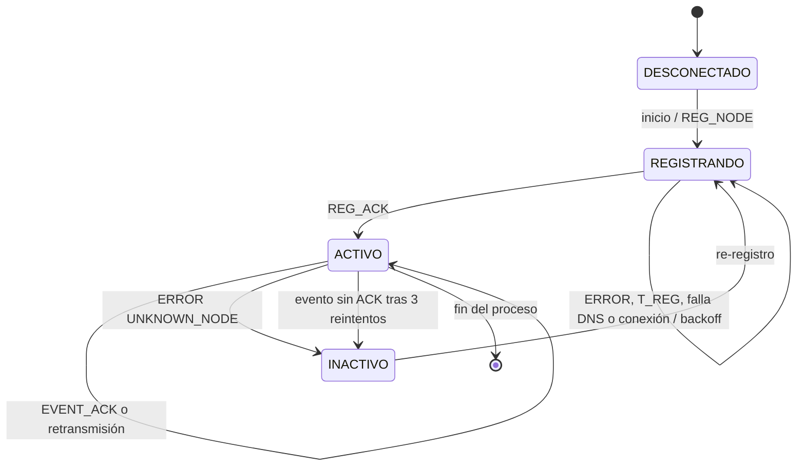
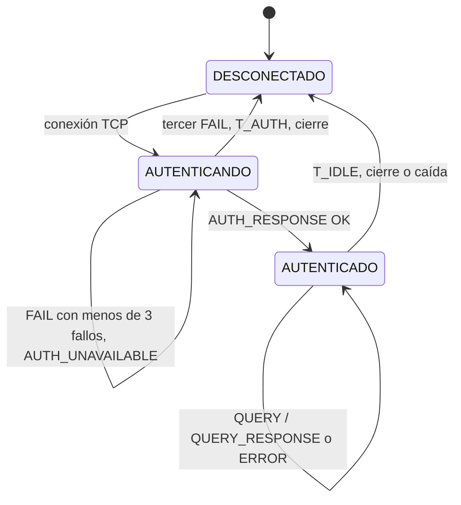
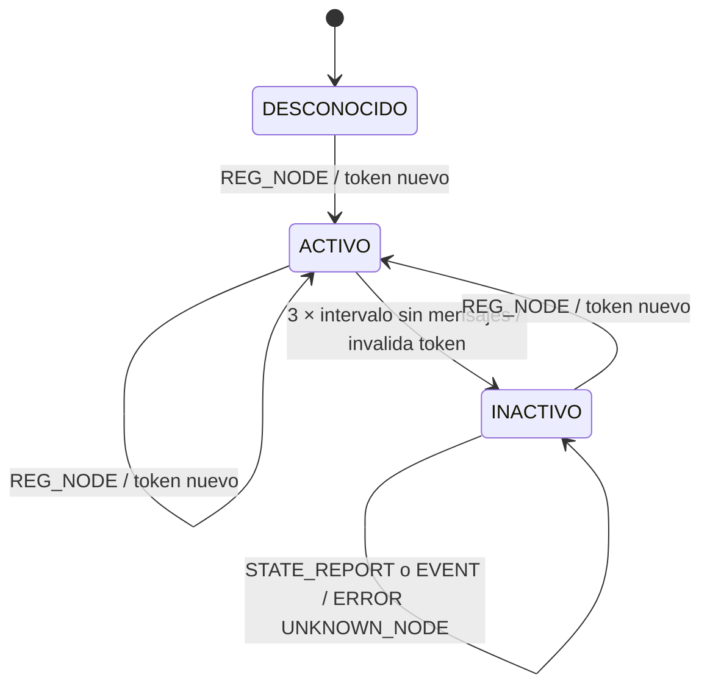
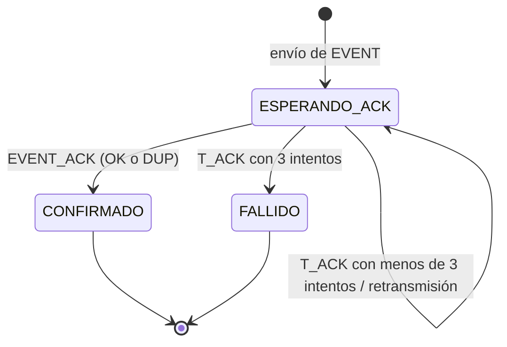

# Máquinas de estado SMCD

## Nodo

```mermaid
stateDiagram-v2
    [*] --> DESCONECTADO
    DESCONECTADO --> REGISTRANDO: inicio / REG_NODE
    REGISTRANDO --> ACTIVO: REG_ACK
    REGISTRANDO --> REGISTRANDO: ERROR, T_REG, falla DNS o conexión / backoff
    ACTIVO --> ACTIVO: intervalo / STATE_REPORT
    ACTIVO --> ACTIVO: EVENT_ACK o retransmisión
    ACTIVO --> INACTIVO: ERROR UNKNOWN_NODE
    ACTIVO --> INACTIVO: evento sin ACK tras 3 reintentos
    INACTIVO --> REGISTRANDO: re-registro
    ACTIVO --> [*]: fin del proceso
```

## Sesión de cliente

```mermaid
stateDiagram-v2
    [*] --> DESCONECTADO
    DESCONECTADO --> AUTENTICANDO: conexión TCP
    AUTENTICANDO --> AUTENTICADO: AUTH_RESPONSE OK
    AUTENTICANDO --> AUTENTICANDO: FAIL con menos de 3 fallos, AUTH_UNAVAILABLE
    AUTENTICANDO --> DESCONECTADO: tercer FAIL, T_AUTH, cierre
    AUTENTICADO --> AUTENTICADO: QUERY / QUERY_RESPONSE o ERROR
    AUTENTICADO --> DESCONECTADO: T_IDLE, cierre o caída
```

## Nodo visto por el servidor

```mermaid
stateDiagram-v2
    [*] --> DESCONOCIDO
    DESCONOCIDO --> ACTIVO: REG_NODE / token nuevo
    ACTIVO --> ACTIVO: STATE_REPORT o EVENT válido
    ACTIVO --> ACTIVO: REG_NODE / token nuevo
    ACTIVO --> INACTIVO: 3 × intervalo sin mensajes / invalida token
    INACTIVO --> INACTIVO: STATE_REPORT o EVENT / ERROR UNKNOWN_NODE
    INACTIVO --> ACTIVO: REG_NODE / token nuevo
```

## Evento en el nodo

```mermaid
stateDiagram-v2
    [*] --> ESPERANDO_ACK: envío de EVENT
    ESPERANDO_ACK --> CONFIRMADO: EVENT_ACK (OK o DUP)
    ESPERANDO_ACK --> ESPERANDO_ACK: T_ACK con menos de 3 intentos / retransmisión
    ESPERANDO_ACK --> FALLIDO: T_ACK con 3 intentos
    CONFIRMADO --> [*]
    FALLIDO --> [*]
```
