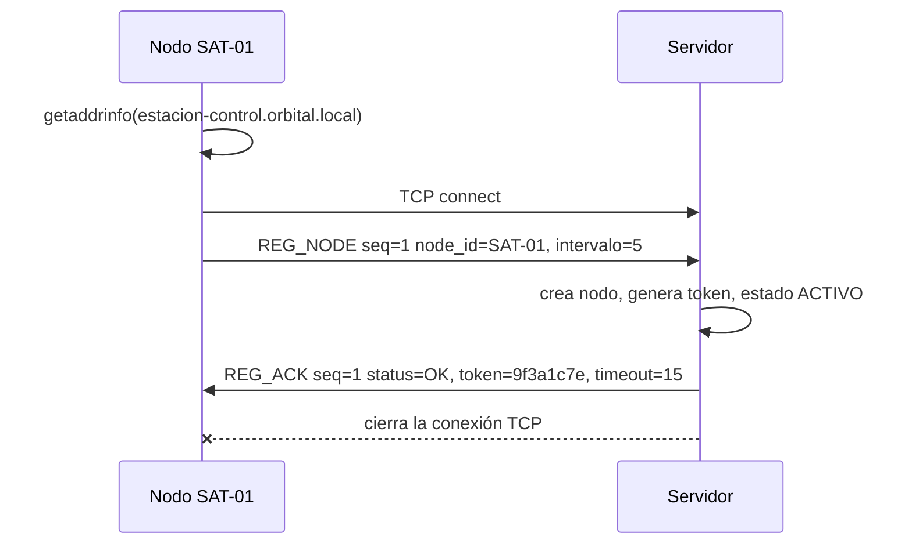
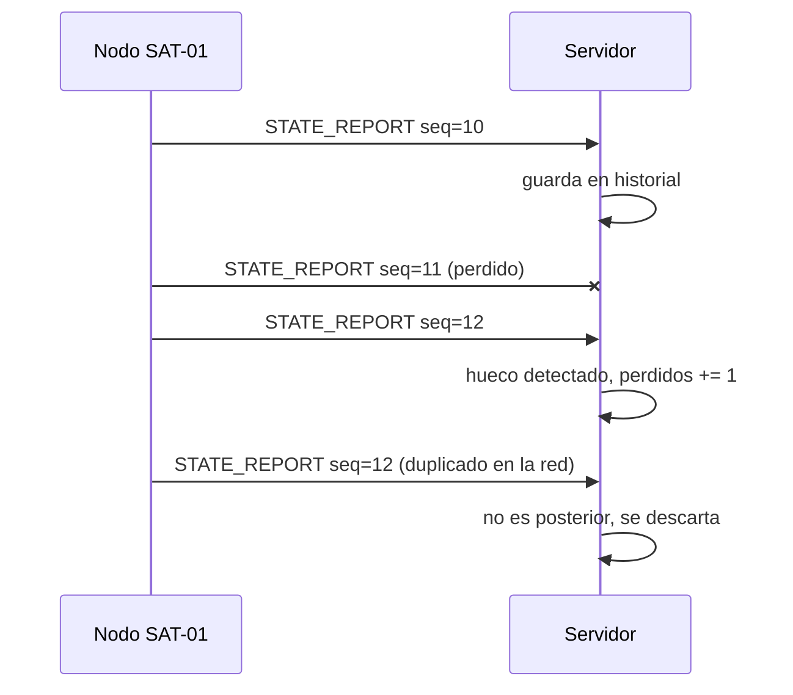
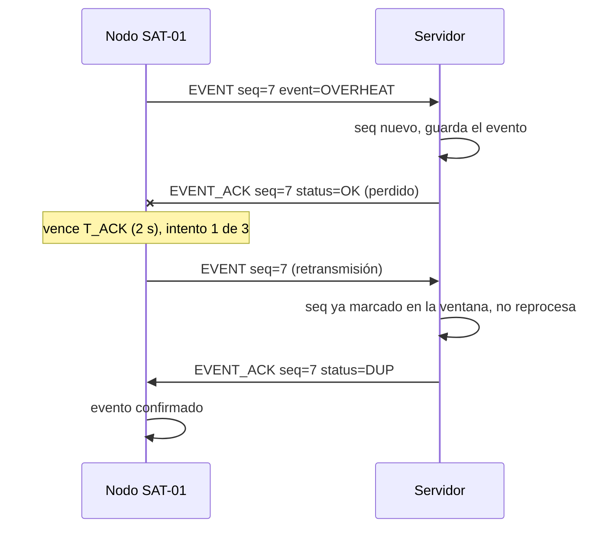
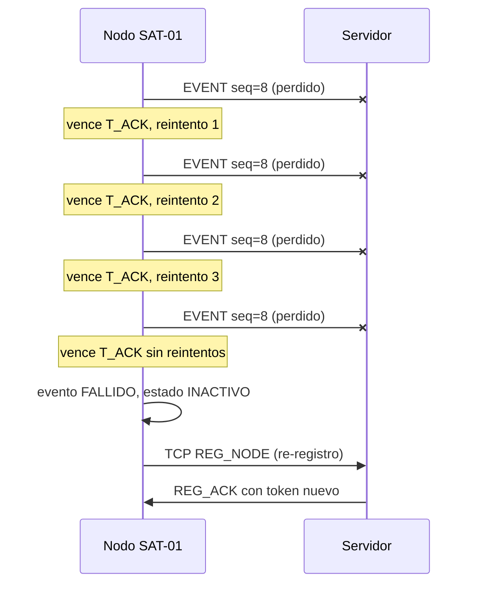
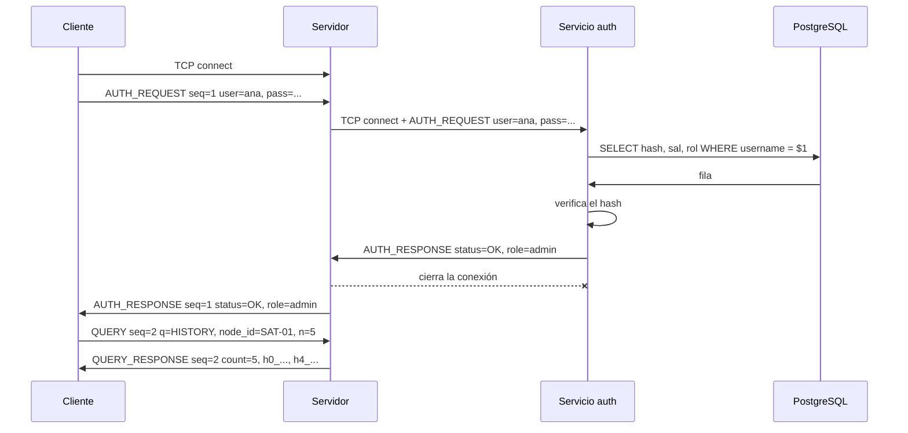
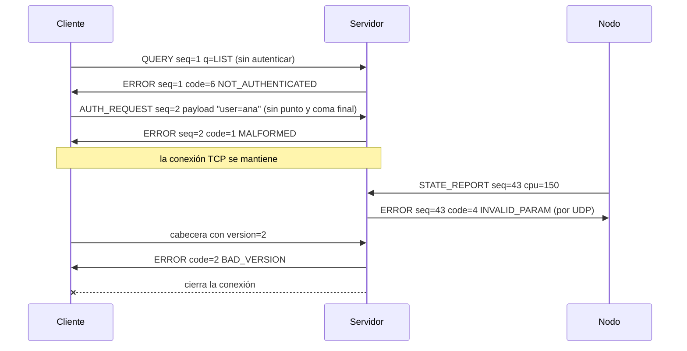
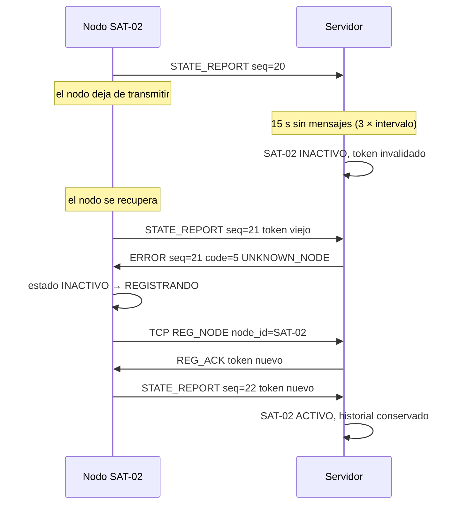

# Diagramas de secuencia SMCD

## 1. Registro de un nodo

## 2. Reportes periódicos con un reporte perdido

## 3. Evento con ACK perdido, retransmisión y duplicado

## 4. Evento fallido tras agotar los reintentos

## 5. Autenticación y consulta de historial

## 6. Mensajes inválidos y errores

## 7. Nodo inactivo y re-registro

